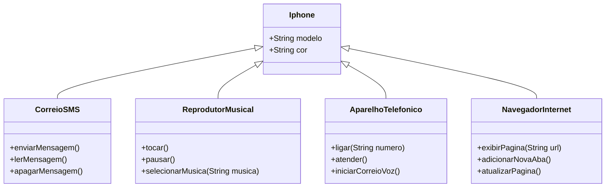

## Projeto IPhone POO

```mermaid
classDiagram
        Iphone <|-- CorreioSMS
        Iphone <|-- ReprodutorMusical
        Iphone <|-- AparelhoTelefonico
        Iphone <|-- NavegadorInternet

        Iphone : +String modelo
        Iphone : +String cor

        class CorreioSMS {
            +enviarMensagem()
            +lerMensagem()
            +apagarMensagem()
        }

        class ReprodutorMusical {
            +tocar()
            +pausar()
            +selecionarMusica(String musica)
        }

        class AparelhoTelefonico {
            +ligar(String numero)
            +atender()
            +iniciarCorreioVoz()
        }

        class NavegadorInternet {
            +exibirPagina(String url)

            +adicionarNovaAba()
    
            +atualizarPagina()
        }


```